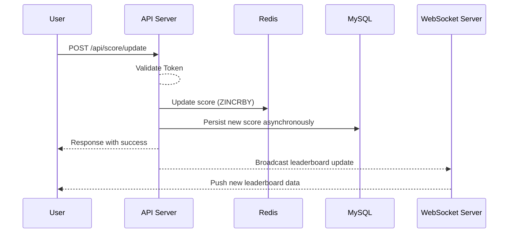
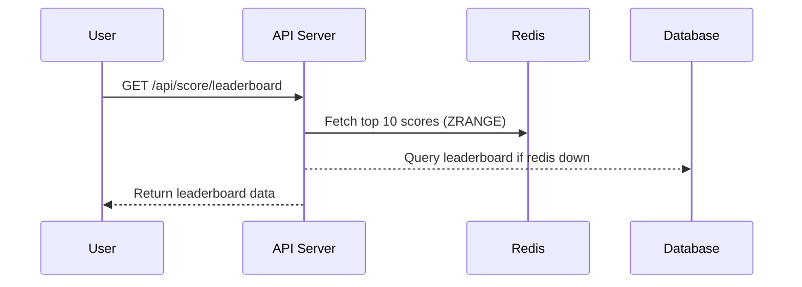
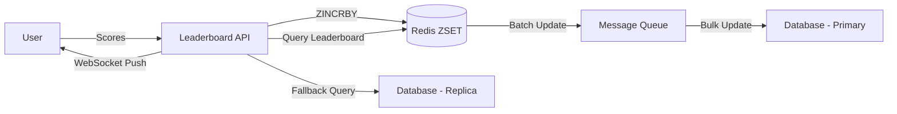

# Problem 6 - Scoreboard System Design

## First Thoughts

For the basic problem, I will consider the number of users is not too large, number of reads is much more than the number of writes, and the number of writes is not too large.
It mean QPS (Query Per Second) and TPS (Transaction Per Second) are not too high.

> If we want handle milions/billions of users, we need to consider a lot of things like sharding, caching, microservices, etc.
>
> I just only write a good approach for the basic problem. I also write some techniques to handle higher traffic in the advanced topio below, please check it.


## Overview

This API module provides real-time leaderboard updates and score tracking for users performing specific actions. It utilizes **NestJS**, **TypeORM**, **MySQL** and **Redis** for high performance and scalability.

## Tech Stack

- **NestJS**: Framework for building scalable Node.js applications
- **MySQL**: Relational database for storing user data
- **TypeORM**: ORM for interacting with relational databases
- **Redis**: Used for leaderboard ranking with Sorted Sets (ZSET)
- **WebSockets**: Real-time leaderboard updates for front-end clients

## Endpoints

### 1. Update Score

**URL:** `/api/score/update`  
**Method:** `POST`  
**Description:** Increments a user's score upon action completion.

**Request:**
```json
{
  "userId": "string",
  "actionType": "string",
  "timestamp": "ISO8601"
}
```

**Example Response:**
```json
{
  "success": true,
  "newScore": 1500
}
```

**Implementation:**
- Check JWT token for authentication.
- Validates the action type and user ID.
- Increments the user's score by a fixed amount.
  - Persists the new score in the database.
  - Updates the score in Redis ZSET for fast ranking.
- Broadcasts leaderboard update via WebSocket.

**Security Measures:**
- JWT authentication required
- ActionType validation to prevent abuse
- Rate limiting to prevent spamming

**Sequence Diagram**



### 2. Get Leaderboard

**URL:** `/api/score/leaderboard`  
**Method:** `GET`  
**Description:** Retrieves the top 10 users with the highest scores using Redis Sorted Sets for optimized ranking. If redis is broken, it will fallback to the database.

**Implementation:**
- **Redis ZSET** stores user scores for fast ranking retrieval.
- Fallback to the database if Redis is unavailable.
- Leaderboard updates are propagated in real-time via WebSocket.

*Example Response:**

```json
{
  "topUsers": [
    {"userId": "123", "score": 2000},
    {"userId": "456", "score": 1950}
  ]
}
```

**Sequence Diagram**



### 3. Real-time Scoreboard Updates

**Method:** WebSockets
**Description:** Provides real-time leaderboard updates when a score changes.

#### Implementation Details Example

**NestJS Service (Score Update & Leaderboard)**

```typescript
import { Injectable } from '@nestjs/common';
import { InjectRepository } from '@nestjs/typeorm';
import { Repository } from 'typeorm';
import { RedisService } from 'nestjs-redis';
import { UserScore } from './entities/user-score.entity';

@Injectable()
export class ScoreService {
  constructor(
    @InjectRepository(UserScore)
    private readonly scoreRepo: Repository<UserScore>,
    private readonly redisService: RedisService
  ) {}

  async updateScore(userId: string, points: number): Promise<number> {
    const redisClient = this.redisService.getClient();
    await redisClient.zincrby('leaderboard', points, userId);
    const newScore = await redisClient.zscore('leaderboard', userId);
    
    // Persist to DB asynchronously
    await this.scoreRepo.upsert({ userId, score: newScore }, ['userId']);
    return Number(newScore);
  }

  async getLeaderboard(): Promise<{ userId: string; score: number }[]> {
    const redisClient = this.redisService.getClient();
    const leaderboard = await redisClient.zrevrange('leaderboard', 0, 9, 'WITHSCORES');
    return this.formatLeaderboard(leaderboard);
  }

  private formatLeaderboard(data: string[]): { userId: string; score: number }[] {
    const result = [];
    for (let i = 0; i < data.length; i += 2) {
      result.push({ userId: data[i], score: Number(data[i + 1]) });
    }
    return result;
  }
}
```

#### WebSocket Gateway (Real-time Updates)

```typescript
import { WebSocketGateway, WebSocketServer, OnGatewayInit } from '@nestjs/websockets';
import { Server } from 'socket.io';
import { ScoreService } from './score.service';

@WebSocketGateway({ cors: true })
export class ScoreGateway implements OnGatewayInit {
  @WebSocketServer() server: Server;

  constructor(private readonly scoreService: ScoreService) {}

  afterInit() {
    console.log('WebSocket initialized');
  }

  async broadcastLeaderboardUpdate() {
    const leaderboard = await this.scoreService.getLeaderboard();
    this.server.emit('leaderboardUpdate', leaderboard);
  }
}
```

#### API Integration for WebSocket Updates
```typescript
import { Controller, Post, Body } from '@nestjs/common';
import { ScoreService } from './score.service';
import { ScoreGateway } from './score.gateway';

@Controller('score')
export class ScoreController {
  constructor(
    private readonly scoreService: ScoreService,
    private readonly scoreGateway: ScoreGateway
  ) {}

  @Post('update')
  async updateScore(@Body() body: { userId: string; actionType: string }) {
    const { userId } = body;
    const newScore = await this.scoreService.updateScore(userId, 10); // Increment by 10
    this.scoreGateway.broadcastLeaderboardUpdate();
    return { success: true, newScore };
  }
}
```

## Security & Performance Optimizations
- **Authentication**: JWT-based auth for API security.
- **Anti-cheat Measures**: Action type validation, request signing, and rate limiting.
- **High Performance**:
    - **Redis ZSET** for fast leaderboard retrieval.
    - **Asynchronous DB updates** to reduce load.
    - **WebSockets** for instant updates without polling.

## Advanced


**Handling High TPS (Transactions Per Second) & QPS (Queries Per Second)**

A leaderboard system must handle **millions of users**, leading to **high TPS (frequent score updates)** and **high QPS (frequent leaderboard queries)**. Without optimizations, this can **overload the database** and degrade performance. Below is a detailed breakdown of challenges and solutions.

### **Challenges**

#### **1. High TPS (Frequent Score Updates)**
- Users frequently update scores, leading to:
  - **Database bottlenecks** due to frequent `UPDATE` queries.
  - **Row locks and contention** when multiple users modify the same records.
  - **Increased write latency**, impacting leaderboard accuracy.

#### **2. High QPS (Frequent Leaderboard Queries)**
- Many users request leaderboard rankings, causing:
  - **Heavy reads on Redis** when fetching rankings.
  - **Database overload** if Redis fails and queries are redirected to the database.
  - **Performance degradation** for real-time leaderboard requests.


### **Solutions for High TPS (Frequent Score Updates)**

#### **1. Store Scores in Redis First**
- Instead of directly writing to the database, **store scores in Redis ZSET (Sorted Set)**.
- This allows:
  - **Fast score updates** using `ZINCRBY` in O(log N) time.
  - **Instant ranking calculation** without complex SQL queries.

**Example (Using Redis ZSET for score updates)**:
```typescript
await redisClient.zincrby("leaderboard", 100, "user:123"); // Increase score by 100
```

#### **2. Batch Processing Instead of Immediate Writes**
- Writing to the database for every score update **causes excessive I/O operations**.
- Instead, **aggregate updates in Redis** and **persist them in batches** using a queue.

**Implementation:**
1. **Queue updates in Redis** (e.g., store updates in a temporary list).
2. **Use a background worker** (RabbitMQ, Kafka) to flush scores to the database **every 100ms**.
3. **Bulk insert/update** to reduce database write contention.

**Example (Batch writing scores to the database)**:
```typescript
const updates = await redisClient.lrange("score_updates", 0, -1); // Fetch queued updates
const bulkUpdates = updates.map(update => `(${update.userId}, ${update.score})`).join(",");
await db.query(`INSERT INTO scores (user_id, score) VALUES ${bulkUpdates} 
                ON DUPLICATE KEY UPDATE score = VALUES(score)`);
await redisClient.del("score_updates"); // Clear the queue after processing
```

#### **3. Reduce Database Locks with Bulk Updates**

- If batch updates are still frequent, **reduce lock contention** with `INSERT ... ON DUPLICATE KEY UPDATE`.

**Optimized SQL Bulk Insert**:
```sql
INSERT INTO scores (user_id, score)
VALUES (1, 100), (2, 200)
ON DUPLICATE KEY UPDATE score = score + VALUES(score);
```
- This avoids unnecessary locks and speeds up score updates.

### **Solutions for High QPS (Frequent Leaderboard Queries)**

#### **1. Use Redis Caching for Leaderboard Queries**
- **Fetch rankings from Redis instead of the database**.
- Redis **ZSET (Sorted Sets)** allow **O(log N) retrieval** for rankings.

**Example (Fetching the top 10 leaderboard scores)**:
```typescript
const topUsers = await redisClient.zrevrange("leaderboard", 0, 9, "WITHSCORES");
```

#### **2. Implement Database Fallback with Rate Limiting**

- If **Redis crashes**, querying the database directly **can overload it**.
- **Solution:**
  - **Use a circuit breaker**: If Redis fails, fallback to **database caching**.
  - **Throttle fallback queries** using a **request limiter**.

**Example (Circuit breaker for fallback queries)**:
```typescript
if (redisDown) {
  if (fallbackQueryAllowed()) {
    return await db.query("SELECT user_id, score FROM scores ORDER BY score DESC LIMIT 10");
  } else {
    throw new Error("Too many leaderboard requests");
  }
}
```

#### **3. Read-Write Separation with Database Replication**
- **High QPS can overwhelm a single database instance**.
- **Solution:** **Use read replicas** to distribute queries.

**Architecture:**
1. **Writes go to the primary database.**
2. **Leaderboard queries go to read replicas.**

**Example (Using TypeORM for read/write separation in NestJS)**:
```typescript
const AppDataSource = new DataSource({
  type: "mysql",
  replication: {
    master: { host: "master-db", port: 3306, username: "root", password: "pass" },
    slaves: [
      { host: "replica-1", port: 3306, username: "root", password: "pass" },
      { host: "replica-2", port: 3306, username: "root", password: "pass" }
    ]
  }
});
```

---

#### **4. Implement WebSockets for Real-Time Updates**
- Instead of polling the leaderboard every second, **push updates via WebSocket**.

**Benefits:**
- **Reduces API calls** for leaderboard updates.
- **Users receive real-time ranking changes**.

**Example (Using WebSocket to push leaderboard updates)**:
```typescript
@WebSocketGateway()
export class LeaderboardGateway {
  @WebSocketServer()
  server: Server;

  async broadcastLeaderboardUpdate() {
    const topUsers = await redisClient.zrevrange("leaderboard", 0, 9, "WITHSCORES");
    this.server.emit("leaderboard_update", topUsers);
  }
}
```

### **Scaling Strategies for High TPS & QPS**
| **Strategy**            | **Use Case**                        | **Benefit**                          |
|-------------------------|-----------------------------------|--------------------------------------|
| **Redis ZSET for ranking**  | Fast leaderboard retrieval | O(log N) ranking calculation |
| **Batch score updates** | Reduce database writes | Prevents high write contention |
| **Rate limiting** | Prevent abuse of leaderboard queries | Prevents database overload |
| **Read replicas** | Handle high query volume | Distributes load across multiple DBs |
| **WebSocket updates** | Reduce polling for leaderboard | Improves real-time performance |

---

## **Final Architecture Design**

---

## **Conclusion**

By integrating **Redis ZSET, batch processing, WebSockets, and database replication**, the leaderboard system can handle **millions of users** efficiently without **overloading the database**. These strategies ensure **high availability**, **scalability**, and **real-time performance**. 🚀

We need to find the good fit for the problem, the budget, the team, the timeline, the future plan, etc. to choose the best solution base on real-world scenarios.